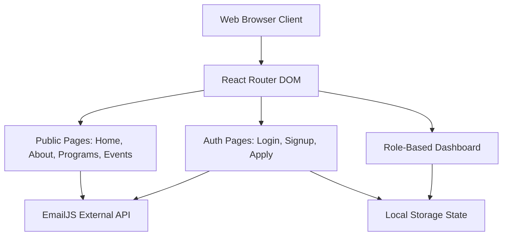
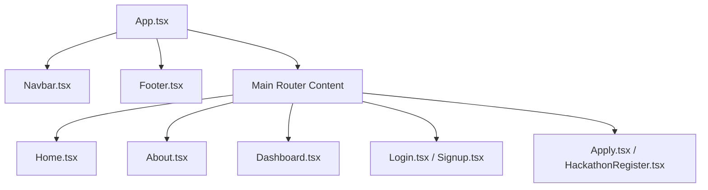

# AMET Incubation Centre - Complete Architecture Documentation

An end-to-end web platform designed for the AMET University Technology Business Incubator. This document serves as the comprehensive architectural reference for the system, detailing its structure, data flow, component hierarchy, and design system.

---

## 1. System Architecture Overview

The AMET Incubation platform is built as a **Single Page Application (SPA)** using React and Vite. It utilizes a client-side architecture where routing, state management, and role-based access control (RBAC) are handled directly in the browser. 

Since this is the MVP (Minimum Viable Product) version, it currently uses a **Serverless/Local Architecture** for data persistence (simulated via `localStorage`) and leverages third-party APIs (EmailJS) for backend microservices.



---

## 2. Frontend Architecture

### 2.1 View Layer (React + Vite)
- **Vite** is used as the build tool, providing ultra-fast Hot Module Replacement (HMR) and optimized production builds.
- **React 18** is used for building the declarative UI. It uses functional components and Hooks (`useState`, `useEffect`, `useRef`) exclusively.

### 2.2 Routing Architecture
Routing is handled by `react-router-dom`. The application intercepts URL changes and dynamically loads the required component without refreshing the page.
- **Fallback Routing**: Any undefined route (e.g., `/unknown-page`) redirects to a custom `<NotFound />` component.
- **Dynamic Routing**: The Hackathon Registration uses dynamic URL parameters (`/register/hackathon/:id`) to render data specific to the selected event.

### 2.3 State Management
Given the lightweight nature of the MVP, global state (like user authentication and roles) is persisted in the browser's `localStorage`.
- **Role Detection**: When a user registers (`/signup`), their chosen role (Student, Startup, Mentor, Admin) is saved to `localStorage`.
- **Conditional Rendering**: The `/dashboard` route reads the `localStorage` and conditionally renders completely different dashboard layouts based on the role.

---

## 3. Component Hierarchy

The application follows a strict atomic/modular structure. Shared UI elements (like the Navbar and Footer) wrap the main content router.



---

## 4. Data Flow & Integrations

### 4.1 EmailJS Microservice Integration
Because the platform lacks a traditional backend, transactional emails (like Hackathon Registration confirmations) are handled directly from the frontend using **EmailJS**.
1. User fills out the `<form>` in `HackathonRegister.tsx`.
2. On submit, `e.preventDefault()` prevents page reload.
3. The component sets an `isSubmitting` state to true (triggering a loading UI).
4. `emailjs.sendForm()` is called, sending the form payload directly to the EmailJS SMTP servers.
5. Upon a `200 OK` response, the UI swaps to a "Success" screen.

### 4.2 Multi-Step Form Data Handling
The Incubation Application (`Apply.tsx`) is a complex, 3-step form. 
- It uses a unified state object: `const [formData, setFormData] = useState({...})`.
- A `step` integer state controls which portion of the form is rendered.
- Progress is visually represented by a custom stepper UI at the top of the page.

---

## 5. Role-Based Access Control (RBAC) Architecture

The core of the system's logic lies in the **Role-Based Dashboard**. Instead of creating four separate pages, `Dashboard.tsx` acts as a central controller.

1. **Authentication Check**: The component checks `localStorage.getItem('userRole')`.
2. **Missing Auth**: If no role is found, it automatically redirects to `/login` using `useNavigate()`.
3. **Role Routing**: 
   - `role === 'student'` ➔ Renders `renderStudentDashboard()` (Shows hackathon participation, learning tracks).
   - `role === 'startup'` ➔ Renders `renderStartupDashboard()` (Shows funding status, mentor assignments).
   - `role === 'mentor'` ➔ Renders `renderMentorDashboard()` (Shows assigned startups, meeting schedules).
   - `role === 'admin'` ➔ Renders `renderAdminDashboard()` (Shows platform metrics, pending applications).

---

## 6. Design System & UI Architecture

The platform uses a custom, Vanilla CSS design system optimized for performance (zero heavy CSS framework dependencies like Bootstrap or Tailwind).

- **Global Variables**: `index.css` contains the `:root` variables defining the entire color palette, typography (`Inter` and `Poppins`), layout constraints (`--max-width: 1200px`), and standardized shadows (`--shadow-md`).
- **Glassmorphism**: Elements like the scrolled `Navbar` use `backdrop-filter: blur(16px)` and semi-transparent backgrounds to create a modern, "frosted glass" effect over the content.
- **Hero Video Background**: The homepage utilizes an HTML5 `<video>` element with `autoPlay loop muted`, layered underneath a `rgba(15, 23, 42, 0.7)` gradient overlay to ensure text contrast while remaining dynamic.
- **Micro-Animations**: All buttons, cards, and links use `transition: all var(--transition-fast)` with `transform: translateY(-4px)` on hover to make the interface feel alive and tactile.

---

## 7. Folder Structure & Organization

```text
src/
├── assets/             # Static assets (images, placeholder videos)
├── components/
│   └── layout/         # Shared global UI components
│       ├── Navbar.tsx
│       ├── Navbar.css
│       ├── Footer.tsx
│       └── Footer.css
├── pages/              # Independent Route Views
│   ├── Apply.tsx       # 3-step incubation form
│   ├── Dashboard.tsx   # Role-controller dashboard
│   ├── Events.tsx      # Hackathons & Workshop list
│   ├── HackathonRegister.tsx # Form with EmailJS integration
│   ├── Home.tsx        # Video hero landing page
│   ├── Login.tsx       # Authentication entry
│   ├── Signup.tsx      # Registration & role assignment
│   └── ... (Other static pages)
├── App.tsx             # Main React Router configuration
├── index.css           # Global design system & variables
└── main.tsx            # React DOM entry point
```

---

## 8. Setup, Deployment & Maintenance

### Local Development
```bash
git clone https://github.com/aaf-codes/website-pagesss.git
cd website-pagesss
npm install
npm run dev
```

### Production Build
```bash
npm run build
```
Vite will bundle the React application into static HTML, CSS, and JS files located in the `/dist` directory. These files can be hosted on any static hosting provider (e.g., Vercel, Netlify, GitHub Pages, or AWS S3).

### Environment Variables & Secrets
Currently, the EmailJS credentials are hardcoded in `HackathonRegister.tsx`. For production deployment, these should be moved to a `.env` file:
```env
VITE_EMAILJS_SERVICE_ID=your_service_id
VITE_EMAILJS_TEMPLATE_ID=your_template_id
VITE_EMAILJS_PUBLIC_KEY=your_public_key
```
And referenced in the code via `import.meta.env.VITE_EMAILJS_SERVICE_ID`.